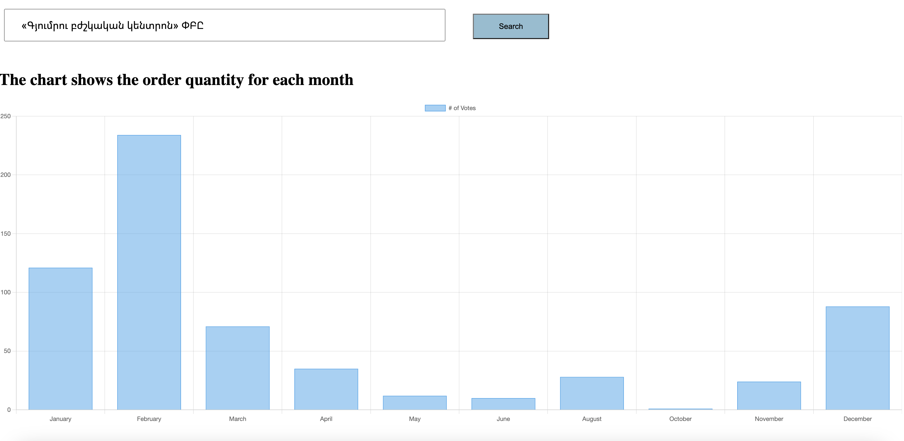

# Order Count Tracker

This Python application built with FastAPI provides a convenient way to view the number of government purchases of a specific company for the last year. It utilizes a local PostgreSQL database to store and retrieve the necessary data. 

## Features

- **FastAPI**: Utilizes the FastAPI framework for building APIs quickly and efficiently.
- **PostgreSQL Database**: Stores order data locally in a PostgreSQL database.
- **Order Count Visualization**: Displays the count of orders for each company over the last year.
- **RESTful API**: Provides a RESTful API for accessing order count data.

### Prerequisites

- Python 3.7+
- PostgreSQL

### Screenshots

